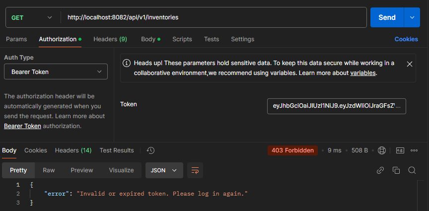

<h1>Inventory Management API Documentation (Summarized)<h1>

This document provides an introduction, explains the technologies used, API architecture, and includes an example endpoint explanation for learning purposes.

---

## Introduction

The **Inventory Management API** is a basic implementation showcasing the key aspects of building a RESTful API. It provides features for managing users, inventories, and products. The purpose of this API is to demonstrate backend concepts like layered architecture, authentication, and CRUD operations.

---

- [Introduction](#introduction)
- [Technologies Used](#technologies-used)
- [API Architecture](#api-architecture)
  - [HTTP Methods:](#http-methods)
  - [Path:](#path)
  - [Headers:](#headers)
  - [Authentication \& Authorization:](#authentication--authorization)
  - [Authorization Example in Postman:](#authorization-example-in-postman)
  - [Login Example in Postman:](#login-example-in-postman)
- [Endpoints](#endpoints)
  - [Key Endpoints:](#key-endpoints)
- [Directory Structure](#directory-structure)
  - [Layers:](#layers)
  - [Project Structure:](#project-structure)
  - [Resources:](#resources)
- [Example Endpoint: `GET /api/v1/inventories`](#example-endpoint-get-apiv1inventories)
  - [Purpose](#purpose)
  - [Request](#request)
  - [Response](#response)
    - [**Success Response** (200 OK):](#success-response-200-ok)
    - [**Error Response** (401 Unauthorized):](#error-response-401-unauthorized)
- [Usage](#usage)

---

## Technologies Used

- **Java (Spring Boot)**: Framework used for API development.
- **MariaDB**: Relational database for data storage.
- **JWT (JSON Web Tokens)**: Token-based authentication mechanism.
- **Apache Commons IO**: For file handling and I/O operations.
- **Apache Tika Core**: For detecting and analyzing file types.
- **IntelliJ IDEA**: Development environment.
- **Maven**: Dependency management and project building.
- **Postman**: API testing tool.

---

## API Architecture

The API is based on a simple, layered architecture for better maintainability and scalability.

### HTTP Methods:
- **GET**: Retrieve data (e.g., fetching inventories).
- **POST**: Add new resources (e.g., creating a user).
- **PUT**: Update existing resources (e.g., modifying inventory details).
- **DELETE**: Remove resources (e.g., deleting products).

### Path:
API paths follow a hierarchical structure, starting with `/api/v1/` to indicate the version. The API runs on port `8082`.

Examples:
- `http://localhost:8082/api/v1/users`: GET/POST users.
- `http://localhost:8082/api/v1/inventories`: GET/POST inventories.
- `http://localhost:8082/api/v1/products`: GET/POST products.

### Headers:
Every request to secured endpoints requires an `Authorization` header:
```
Authorization: Bearer <JWT_TOKEN>
```

### Authentication & Authorization:

The API uses **JWT (JSON Web Tokens)** for secure communication, with **HS256** (HMAC with SHA-256) as the signing algorithm to ensure token integrity and security. Tokens are issued upon successful login and must be sent with subsequent requests in the `Authorization` header. Below is a visualization of the authorization process:


### Authorization Example in Postman:

To use the API in Postman, include the JWT token in the `Authorization` tab as a **Bearer Token**. Here's an example visualization:


### Login Example in Postman:


---

## Endpoints

### Key Endpoints:
1. **User Management**:
   - `POST /api/v1/users`: Create a new user.
   - `GET /api/v1/users/{id}`: Get details of a specific user.

2. **Inventory Management**:
   - `GET /api/v1/inventories`: List all inventories.
   - `POST /api/v1/inventories`: Add a new inventory.

3. **Product Management**:
   - `GET /api/v1/products`: List all products.
   - `POST /api/v1/products`: Add a new product.

---

## Directory Structure

The project follows an **N-Tier Architecture**, ensuring separation of concerns and modularity. Each layer is responsible for a specific functionality in the system. Below is a visualization of the architecture:


### Layers:

1. **Controller Layer**: Handles API requests and responses. This layer interacts directly with the client.
2. **Service Layer**: Contains business logic and ensures proper data processing between the controller and repository layers.
3. **Repository Layer**: Handles database operations, such as querying and persisting data.

### Project Structure:

```
src/main/java
├── config       // Configuration classes (e.g., security, CORS)
├── controller   // API endpoint handlers
├── dto          // Data Transfer Objects for requests/responses
├── entity       // Database entity classes
├── exception    // Custom exception handling
├── repository   // Interfaces for database operations
├── service      // Business logic implementation
├── util         // Utility classes (e.g., JWTUtil)
```

### Resources:

- **`application.yml`**: Configuration file for the application (e.g., database connection, port settings).
- **`static/images/user-photos`**: Static directory for storing user profile photos or other static assets.

---

## Example Endpoint: `GET /api/v1/inventories`


### Purpose
Retrieve the list of all inventories.

---

### Request

**HTTP Method**: `GET`  
**Path**: `/api/v1/inventories`  
**Headers**:
```
Authorization: Bearer <JWT_TOKEN>
Content-Type: application/json
```

---

### Response

#### **Success Response** (200 OK):
```json
[
    {
        "id": 17,
        "name": "Warehouse A",
        "description": "Some text",
        "status": "ACTIVE",
        "inventoryType": "WAREHOUSE",
        "address": "Jamal Abdulnasir",
        "area": 490.00,
        "availableArea": 461.00,
        "createdAt": "2024-11-18T03:06:36.000+00:00",
        "updatedAt": "2024-11-19T04:37:13.000+00:00",
    },
    {
        "id": 20,
        "name": "Store A",
        "description": "I am Store ",
        "status": "ACTIVE",
        "inventoryType": "WAREHOUSE",
        "address": "Gamal Street, Taizz",
        "area": 500000.00,
        "availableArea": 500000.00,
        "createdAt": "2024-11-18T19:47:31.000+00:00",
        "updatedAt": "2024-11-18T19:47:31.000+00:00",
    }
```


---

#### **Error Response** (401 Unauthorized):
```json
{
  "status": "error",
  "message": "Unauthorized access. Token is missing or invalid."
}
```



--- 

These responses demonstrate the behavior of the API when the request is successfully authenticated or when the request fails due to missing or invalid authentication.

---

## Usage

1. **Import the Database**  
   The database structure and initial data can be found in the following file:  
   [inventory_management.sql](assets/db).  
   - Use your preferred database tool (e.g., MySQL Workbench, phpMyAdmin, or command line) to import the SQL file into your MySQL server.

   **Default User Credentials**:  
   - **Username**: `n`  
   - **Password**: `n`

2. **Start MySQL**  
   Ensure your MySQL server is running and accessible. Update the `application.yml` file in the project with the correct database credentials and connection URL if required.

3. **Run the API**  
   Start the API using Maven or your preferred IDE (e.g., IntelliJ IDEA):  
   The API will start on the base URL `http://localhost:8082/`.

4. **Test the API**  
   Use tools like **Postman** to interact with the API. Ensure you include the JWT token in the `Authorization` header for secured endpoints.